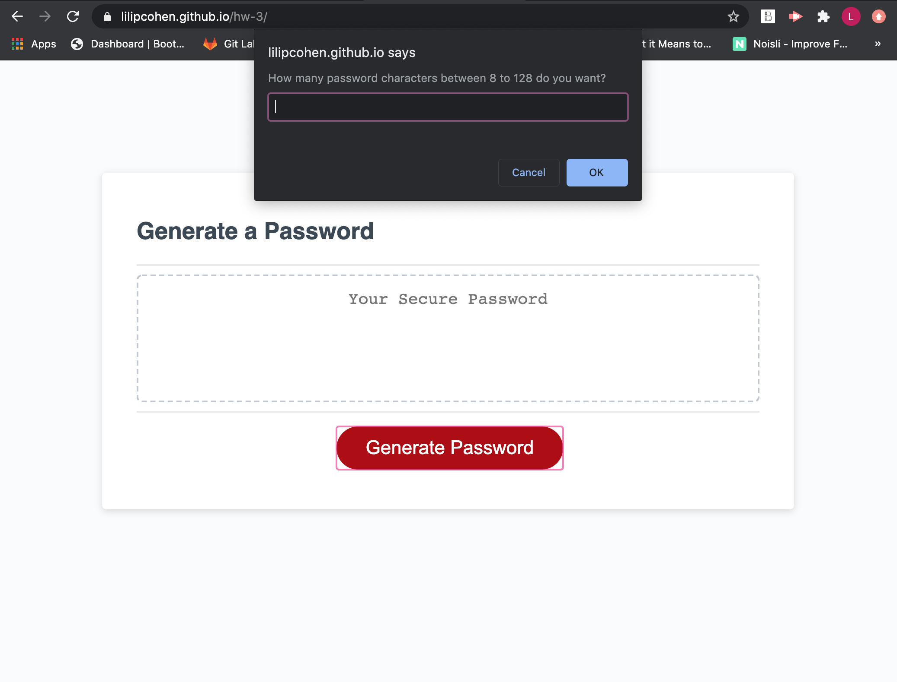
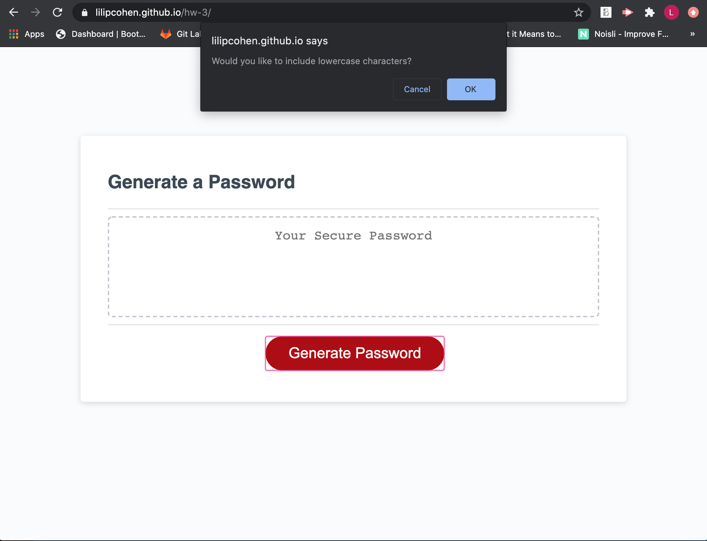
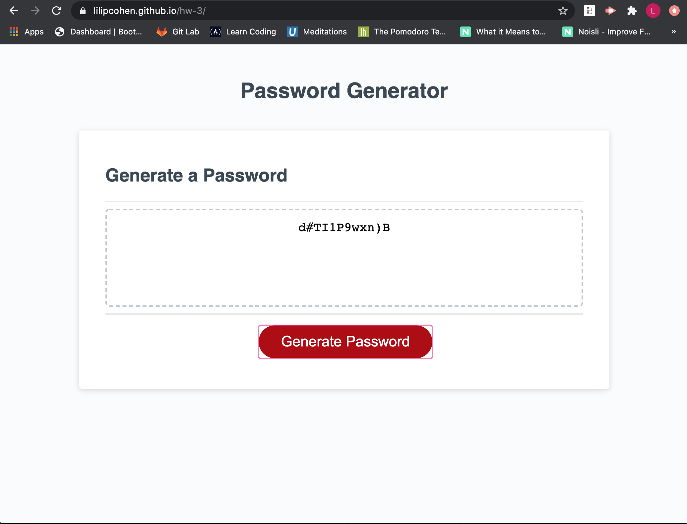

# hw-3
## Overview
For this assignment I was to give the user a list of criteria using prompts that relates to the characters of their generated password. When the user clicks on the generate password button the series of prompts will activate asking the user for how may characters they would like between 8 and 128 and if they would like to include lowercase, uppercase, number, and special characters in their password. The amount of characters they would like between 8 and 128 will be the length of the generated password including the type ofcharacters they choose to include. Once done with the prompts a generated password will appear on the screen.

I did this by first defining variables and associated strings with those variables. I used while statements to validate that the user chose prompts that would not affect the generated password. I used a while statement for the prompt asking for how many characters and converted the string to a number to then associate this with the criteria of type of characters they choose. I also ensured that the user must choose at least one criteria option out of the types of characters there can be. I then created a variable to gather the users chosen options together and formulate a randonly generated password given the length of the user's choice and print it to the page.

[Link](https://lilipcohen.github.io/hw-3/)